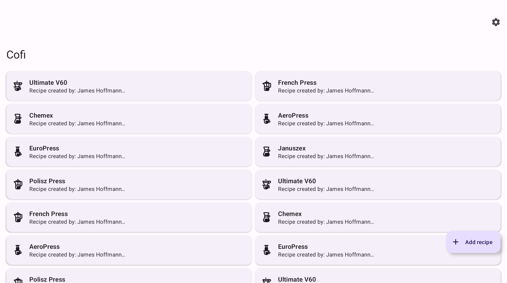
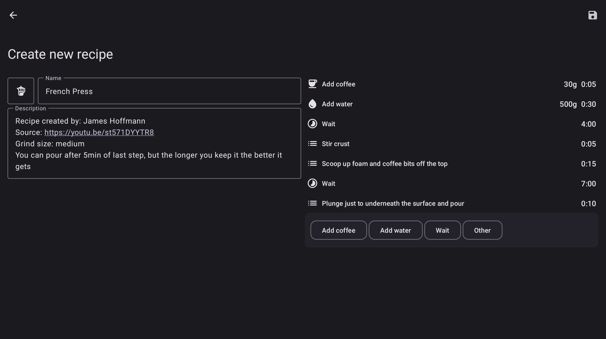
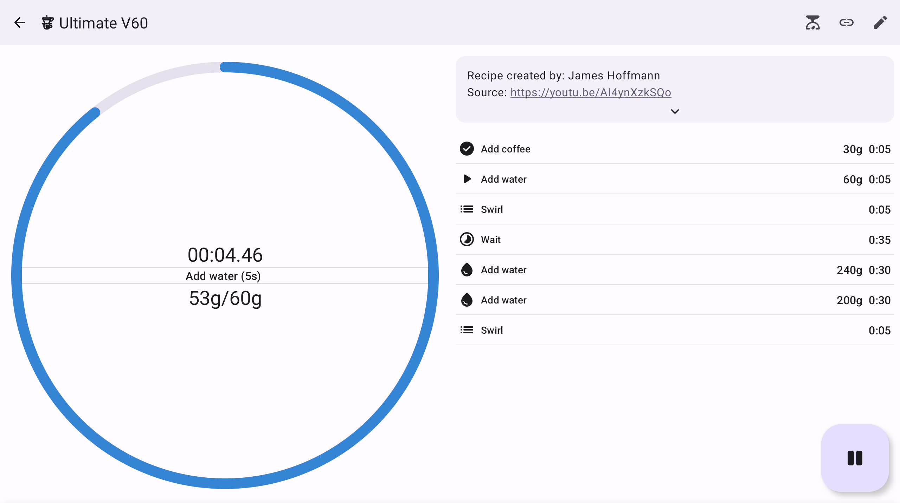
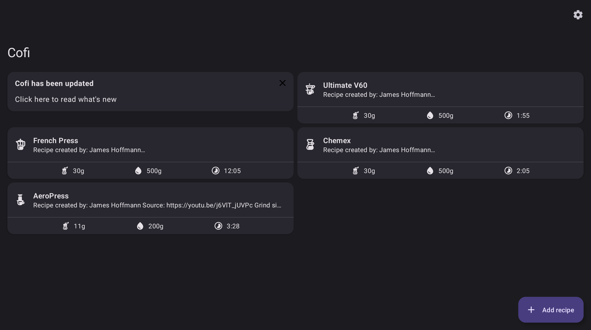
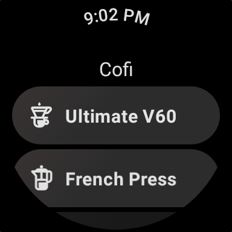
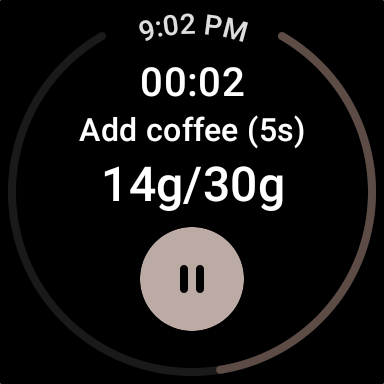

  
  
  
  
  

# Download

  
  
  

# Screenshots
<table>
  <tr>
    <td>Phone</td>
    <td></td>
    <td></td>
    <td></td>
    <td></td>
  </tr>
  <tr>
    <td>Tablet/Foldable</td>
    <td></td>
    <td></td>
    <td></td>
    <td></td>
  </tr>
  <tr>
    <td>WearOS</td>
    <td></td>
    <td></td>
  </tr>
</table>

## [Changelog](docs/Changelog.md) 

<!-- # [Read more](https://rozpierog.github.io/Cofi) -->

# Contribute

- [New language](docs/Contribute/Language.md)
- [New default recipe](docs/Contribute/Recipe.md)
- [New feature](docs/Contribute/CONTRIBUTING.md#featuresimprovements)
- [Bugfix](docs/Contribute/CONTRIBUTING.md#bugfixes)

# License

[GNU GENERAL PUBLIC LICENSE Version 3](LICENSE)
