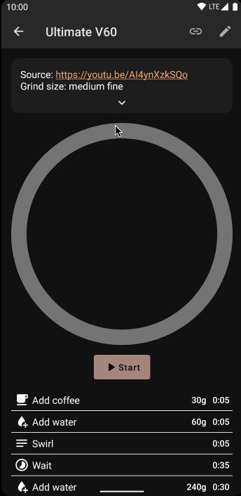

<!-- 

  

 -->

# Why Cofi?

As a passionate coffee lover and amateur barista, I've always been on the hunt for the perfect cup of coffee. That's why I created the free and open-source coffee brew timer for Android. With this app, you can easily time your coffee brews and achieve the perfect flavor every time.

I know how important it is to have complete control over your brew time, and that's exactly what this app provides. Whether you're using a French press, pour-over, or any other brewing method, our app makes it easy to keep track of your brew time and achieve the perfect flavor.

## Features:

- **Open-source and free to use**
- **No artificial limits** on what you can add to the app
- Timer for your coffee brews
- Customizable time settings for different brewing methods
- Easy-to-use interface with a clean design and the latest material design
- **Picture-in-picture** mode for multitasking
- **WearOS app** for easy timing on your smartwatch
- Absolutely **no user tracking or data collection**

I know how frustrating it can be to settle for a mediocre cup of coffee. That's why I want to help you brew like a pro and enjoy the perfect cup every time. Download Cofi now and start your journey to coffee perfection!

## How it looks?

  

## [Github page](https://github.com/rozPierog/Cofi)

## Download

  
  
  

## Contribute to Cofi

- [New language](Contribute/Language.md)
- [New default recipe](Contribute/Recipe.md)
- [New feature or bugfix](Contribute/CONTRIBUTING.md)
